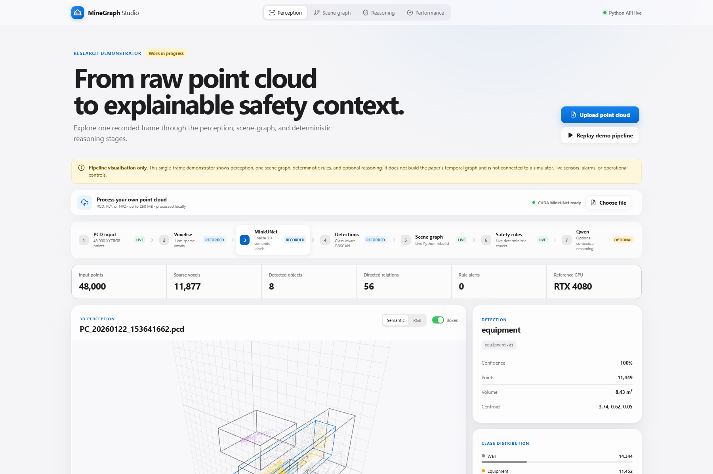

# From 3D Perception to Safety Reasoning

> A self-contained, paper-aligned reference implementation for graph-based underground mine monitoring.

[](https://arxiv.org/abs/2606.03460)
[](https://www.python.org/)
[](https://github.com/maninka123/Scene-Graph_Mine-Safety/actions/workflows/tests.yml)


This repository reconstructs the software pipeline described in **“From 3D Perception to Safety
Reasoning: A Graph-Based Framework for Real-Time Underground Mine Monitoring.”** It provides the
architecture, training and inference entry points, scene and temporal graph construction, deterministic
safety rules, grounded local-LLM reasoning, GraphRAG memory, tests, and an interactive visualiser. It does
not include regenerated experiment results or ablation studies.

## Scope and safety

This is research software, not a certified or operational safety system. The paper pipeline is implemented
in Python, including temporal tracking. The browser app is deliberately narrower: it visualises one frame
and one scene graph so users can inspect the processing stages. The app does **not** create a temporal
graph and is not connected to a simulator, live sensors, alarms, machinery, or operational controls.

## Paper pipeline

| Stage | Implementation |
| --- | --- |
| Sparse 3D perception | XYZRGB sparse input, MinkUNet encoder–decoder, shared 96-D representation, contrastive and semantic heads |
| Uncertainty | Predictive entropy, morphological closing, DBSCAN proposals, and paper merge criteria |
| Scene graph | Object/anomaly nodes and directed proximity relations within 8 m |
| Temporal graph | Hungarian association, 10 s rolling history, velocity, and movement state |
| Safety rules | Proximity, TTC, blind spot, congestion, and low visibility |
| Context reasoning | Appendix A prompt contract with schema and object-ID validation |
| Longitudinal memory | Selective GraphRAG retrieval with local Qdrant, embedding, and reranking adapters |

All traceable constants are collected in [`configs/paper.yaml`](configs/paper.yaml). The executable modules
live under [`src/mine_safety`](src/mine_safety), and the training/inference entry points are in
[`scripts`](scripts).

## MineGraph Studio

MineGraph Studio is a React, Three.js, and FastAPI demonstrator for inspecting the pipeline with a single
scene graph. It includes an interactive point cloud, detection boxes, graph controls, deterministic-rule
evidence, execution timing, optional local Qwen reasoning, and local point-cloud upload support.



```bash
python -m venv .venv
# Windows: .venv\Scripts\activate
# Linux/macOS: source .venv/bin/activate
pip install -e ".[app,llm,dev]"
cd web
npm install
npm run build
cd ..
python scripts/build_demo_bundle.py
python -m uvicorn app.api:app --host 127.0.0.1 --port 8000
```

Open `http://127.0.0.1:8000`. Uploaded `.pcd`, `.ply`, and `.npz` files remain local. GPU segmentation
requires CUDA, MinkowskiEngine, and a compatible local checkpoint. Qwen weights are never downloaded
silently; set `MINEGRAPH_QWEN_MODEL` when using a custom local model path.

## Run the Python pipeline

```bash
pip install -e .
mine-safety examples/scene_graph.json --output outputs/assessment.json
```

Enable local contextual reasoning after installing the LLM dependencies:

```bash
pip install -e ".[llm]"
mine-safety examples/scene_graph.json --llm
```

For point-cloud training and inference, install PyTorch and a compatible MinkowskiEngine build first:

```bash
pip install -e ".[pointcloud]"
python scripts/train_contrastive.py data/unlabelled.jsonl
python scripts/train_semantic.py data/labelled.jsonl
python scripts/infer_point_cloud.py data/example.pcd \
  --checkpoint checkpoints/semantic_nine_class.pt
```

Training `.npz` files contain `points [N,3]`, `colors [N,3]` in `[0,1]`, and supervised files also contain
integer `labels [N]`. JSONL manifests use `{"path":"relative/or/absolute/scene.npz"}`.

## Paper figures

The following are author-supplied paper assets, not results regenerated by this repository.

<table>
  <tr>
    <td align="center" bgcolor="#ffffff"><br><sub>Sparse 3D network</sub></td>
    <td align="center" bgcolor="#ffffff"><br><sub>Uncertainty and anomaly proposals</sub></td>
  </tr>
  <tr>
    <td align="center" bgcolor="#ffffff"><br><sub>Selective longitudinal reasoning</sub></td>
    <td align="center" bgcolor="#ffffff"><br><sub>Graph-grounded hazard examples</sub></td>
  </tr>
</table>

> The supplied anomaly panel shows an earlier voxel setting. The executable configuration follows the
> paper text and uses 0.01 m voxels. The original figure is retained unchanged.

## Validation and deployment

```bash
pip install -e ".[dev]"
pytest -q
```

GitHub Pages can host the read-only frontend bundle. Live Python graph processing, CUDA perception, local
Qwen inference, and Qdrant require a suitable backend and cannot run directly in GitHub Pages.

## Cite

Paper: [arXiv:2606.03460](https://arxiv.org/abs/2606.03460) ·
[DOI: 10.48550/arXiv.2606.03460](https://doi.org/10.48550/arXiv.2606.03460)

```bibtex
@misc{ranasinghe2026from3d,
  title         = {From 3D Perception to Safety Reasoning: A Graph-Based Framework for Real-Time Underground Mine Monitoring},
  author        = {Ranasinghe, Pasindu and Raval, Simit and Patra, Dibyayan and Banerjee, Bikram and Canbulat, Ismet},
  year          = {2026},
  eprint        = {2606.03460},
  archivePrefix = {arXiv},
  primaryClass  = {cs.CV},
  doi           = {10.48550/arXiv.2606.03460}
}
```

Machine-readable metadata is available in [`CITATION.cff`](CITATION.cff).
