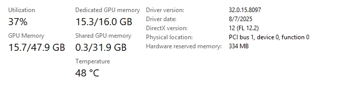
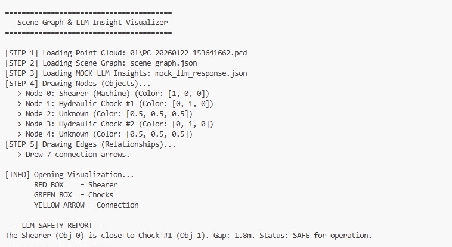

# From 3D Perception to Safety Reasoning

> A self-contained, paper-aligned reference implementation for graph-based underground mine monitoring.

[](https://arxiv.org/abs/2606.03460)
[](https://www.python.org/)
[](https://github.com/maninka123/Scene-Graph_Mine-Safety/actions/workflows/tests.yml)


This repository reconstructs the complete software pipeline described in **“From 3D Perception to
Safety Reasoning: A Graph-Based Framework for Real-Time Underground Mine Monitoring”**. It contains
the architecture and orchestration code, paper parameters, local-model boundaries, tests, an example
scene graph, copied legacy model artefacts, and a redesigned single-graph interactive lab. It deliberately
does **not** include generated experiment results or ablation studies.

## Important scope and safety notice

This is research software, not a certified safety system. The interactive app is a **work-in-progress,
single-scene-graph educational sandbox**. It is not connected to ROS, Gazebo, a mine simulator, live
sensors, alarms, machinery, or operational controls. Its outputs must not be used for safety decisions.

## What is implemented

| Paper stage | Implementation | Paper alignment |
| --- | --- | --- |
| Sparse 3D perception | `perception/network.py` | 6-D xyzrgb input; 32/64/128/256 encoder; symmetric decoder; 96-D shared representation; 128-D contrastive and 9-class semantic heads |
| Two-stage learning | `scripts/train_contrastive.py`, `scripts/train_semantic.py` | NT-Xent τ=0.1, listed augmentations, Adam/cosine schedule, differential fine-tuning rates, early stopping |
| Uncertainty/anomaly | `perception/anomaly.py` | predictive entropy >0.35; minimum 20 voxels; DBSCAN ε=0.10 m; paper merge gates |
| Scene graph | `graph/scene.py` | object/anomaly attributes and directed proximity relations within 8 m |
| Temporal graph | `graph/temporal.py` | Hungarian association, λ=1000 class penalty, 1 m gate, rolling 10 s history, velocities and motion state |
| Deterministic reasoning | `rules.py` | proximity, TTC≤3 s, rear blind spot, congestion, rolling low visibility |
| Contextual reasoning | `reasoning/prompts.py`, `reasoning/llm.py` | Complete Appendix A prompt; exact contextual JSON schema; word limits, ID grounding, and one regeneration attempt |
| Longitudinal memory | `reasoning/graphrag.py` | Appendix B schema; linked-memory filtering; selective triggers; Qwen3 embedding/reranking; top-5 local Qdrant retrieval |
| Single-graph lab | `app/scene_lab.py` | editable scenario builder, 3D graph, rule evidence, JSON export, explicit non-simulator status |

## Repository layout

```text
mine_safety_reasoning/
├── app/                    # Apple-inspired single-scene-graph Streamlit lab
├── assets/figures/         # Architecture and copied legacy reference images
├── checkpoints/            # Contrastive backbone + clearly isolated legacy semantic model
├── configs/paper.yaml      # Traceable parameters from the paper
├── examples/               # Valid scene graph and training-manifest examples
├── scripts/                # Training, point-cloud inference, and app launchers
├── src/mine_safety/        # Perception, graphs, rules, reasoning, memory, orchestration
└── tests/                  # Fast unit tests independent of CUDA and local LLM weights
```

## Quick start: interactive single-graph lab

```bash
python -m venv .venv
# Windows: .venv\Scripts\activate
# Linux/macOS: source .venv/bin/activate
pip install -e ".[app,dev]"
streamlit run app/scene_lab.py
```

The lab opens with a safe-passage scene. Choose a preset, use **Add an object**, or edit/add rows to create proximity,
convergence, rear blind-spot, congestion, visibility, and anomaly scenarios. Spatial relationships and
deterministic evidence update from that one graph. Contextual/GraphRAG panels describe the local runtime
path but remain opt-in so the browser demo never silently downloads or executes an LLM. Because this is a
single snapshot, it does not claim rolling visibility, temporal persistence, recurrence, or escalation.

## Run the graph pipeline

```bash
pip install -e .
mine-safety examples/scene_graph.json --output outputs/assessment.json
```

Add `--llm` only after installing the local reasoning dependencies:

```bash
pip install -e ".[llm]"
mine-safety examples/scene_graph.json --llm
```

The configured reasoning model is `Qwen/Qwen2.5-3B-Instruct`, matching the paper. Inference stays on the
machine; provide model weights through the normal Hugging Face cache or a pre-populated offline cache.

## Perception training and inference

Training data use a small, inspectable format. Each `.npz` contains:

- `points`: float `[N,3]` xyz metres
- `colors`: float `[N,3]` RGB in `[0,1]`
- `labels`: integer `[N]` using the nine-class order in `configs/paper.yaml` (supervised data only)

Each JSONL manifest row contains `{"path":"relative/or/absolute/scene.npz"}`.

```bash
# Install PyTorch and a matching MinkowskiEngine build first.
pip install -e ".[pointcloud]"
python scripts/train_contrastive.py data/unlabelled.jsonl
python scripts/train_semantic.py data/labelled.jsonl
python scripts/infer_point_cloud.py data/example.pcd \
  --checkpoint checkpoints/semantic_nine_class.pt
```

The included `contrastive_backbone.pt` was copied from the prior workspace. The prior semantic checkpoint
has only six output classes, so it is retained under `checkpoints/legacy_six_class/` for provenance and is
never presented as a paper-compatible nine-class model. See [checkpoint notes](checkpoints/README.md).

## Graph and reasoning contract

The graph is the audit boundary. Dense voxel predictions are reduced to nodes containing IDs, labels,
centroids, axis-aligned dimensions, PCA orientation, volume, voxel count, confidence, and entropy. Directed
edges contain metric distance and deterministic flags. The temporal layer adds stable track IDs, velocity,
and movement state. The LLM receives this bounded representation—not raw point clouds—and its JSON is
rejected if it references an absent object or memory.

Deterministic alerts remain independent of LLM availability and latency. Retrieval is selective: anomaly
persistence over 3 seconds, a `developing_over_window` contextual pattern, or archive similarity above 0.70.
Retrieved scores and previous model interpretations are advisory and cannot establish a hazard by themselves.

The Appendix A and B contracts are implemented separately. Contextual results use
`hazard_detected`, `risk_conditions`, `evidence`, `severity`, and `temporal_pattern`; longitudinal results
add exact `memory_ids`, `current_evidence`, and `historical_evidence`. Unsupported fields and ungrounded
object or memory identifiers are rejected.

## Paper figures

The figures below are supplied paper assets, not outputs regenerated by this repository.

<table>
  <tr>
    <td align="center" bgcolor="#ffffff"><br><sub>Sparse 3D network</sub></td>
    <td align="center" bgcolor="#ffffff"><br><sub>Uncertainty and anomaly proposals</sub></td>
  </tr>
  <tr>
    <td align="center" bgcolor="#ffffff"><br><sub>Selective longitudinal reasoning</sub></td>
    <td align="center" bgcolor="#ffffff"><br><sub>Graph-grounded hazard examples</sub></td>
  </tr>
</table>

> Figure fidelity note: the supplied anomaly panel labels voxelisation as 0.05 m and the LLM panel uses
> “emerging.” The executable configuration follows the paper text: 0.01 m voxels and Appendix B patterns
> `recurring` or `escalating`. The figures are retained unchanged as author-supplied illustrations.

<details>
<summary>Example semantic and anomaly detections</summary>


</details>

## Deployment

GitHub Pages can host only static browser assets; it cannot execute this Python Streamlit app, local Qwen
inference, CUDA/MinkowskiEngine, or Qdrant. A Qwen-enabled deployment therefore needs a machine or GPU
container that runs `streamlit run app/scene_lab.py` and keeps model weights and graph memories local.
Do not place a hosted model token in client-side JavaScript. For a public UI, deploy the repository to a
container service or GPU-backed Hugging Face Space and keep the deterministic rule layer independent of
the advisory LLM path.

## Validation

Fast tests cover directed graph construction, class-consistent Hungarian tracking, bounding-box clearance,
congestion, schema parsing, and hallucinated-ID rejection:

```bash
pip install -e ".[dev]"
pytest -q
```

Heavy CUDA, MinkowskiEngine, local-Qwen, and Qdrant integration tests are intentionally environment-specific.
No experimental metrics are claimed by this code package without the paper dataset and evaluation protocol.

## Reference images retained from the original workspace

These are historical implementation snapshots, included because they were present in the source workspace.
They are not regenerated results and are not evidence that this reconstructed pipeline reproduces paper metrics.

<details>
<summary>Legacy GPU utilisation snapshot</summary>



</details>

<details>
<summary>Legacy scene-graph and LLM console snapshot</summary>



</details>

## Cite

Paper: [arXiv:2606.03460](https://arxiv.org/abs/2606.03460) ·
[DOI: 10.48550/arXiv.2606.03460](https://doi.org/10.48550/arXiv.2606.03460)

```bibtex
@misc{ranasinghe2026from3d,
  title         = {From 3D Perception to Safety Reasoning: A Graph-Based Framework for Real-Time Underground Mine Monitoring},
  author        = {Ranasinghe, Pasindu and Raval, Simit and Patra, Dibyayan and Banerjee, Bikram and Canbulat, Ismet},
  year          = {2026},
  eprint        = {2606.03460},
  archivePrefix = {arXiv},
  primaryClass  = {cs.CV},
  doi           = {10.48550/arXiv.2606.03460}
}
```

Machine-readable citation metadata is in [`CITATION.cff`](CITATION.cff).
